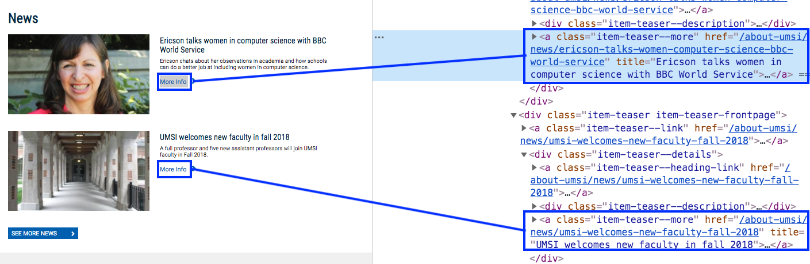

..  shortname:: Explaining
..  description:: Explaining activity.

Code explaining activity
:::::::::::::::::::::::::

Look at the code below, and try to determine what it does.

Relevant tags
**********************

Here's the relevant tag from ``https://www.si.umich.edu/people/barbara-ericson``:

.. raw:: html

  <a href="plan2.html"><pre style="background-color:#FCF3CF;">
  <strong># Load libraries for web scraping</strong>
  from bs4 import BeautifulSoup
  import requests
  <strong># Get a soup from <mark style="background-color:#F1948A">a URL</mark></strong>
  url = <mark style="background-color:#F1948A">'https://www.si.umich.edu/people/barbara-ericson'</mark>
  r = requests.get(url)
  soup = BeautifulSoup(r.content, 'html.parser')</pre></a>
  <a href="plan5.html"><pre style="background-color:#D5F5E3;">
  <strong># Get all tags of <mark>a certain type</mark> from the soup</strong>
  tags = soup.find_all(<mark>'a', class_='item-teaser--heading-link'</mark>)
  <strong># Collect info from the tags</strong>
  collect_info = []
  for tag in tags:
      <strong># Get <mark>info</mark> from tag</strong>
      info = tag.<mark>get('href')</mark>
      collect_info.append(info)</pre></a>
  <a href="plan3.html"><pre style="background-color:#FDEBD0;">
  <strong># Get a soup from multiple URLs</strong>
  base_url = <mark>'https://www.si.umich.edu/'</mark>
  endings = <mark>collect_info</mark>
  for ending in endings:
       url = base_url + ending
       r = requests.get(url)
       soup = BeautifulSoup(r.content, 'html.parser')</pre></a>
       <a href="plan5.html"><pre style="background-color:#D5F5E3;">
       <strong># Get all tags of <mark>a certain type</mark> from the soup</strong>
       tags = soup.find_all(<mark>'p'</mark>)
       # Collect info from the tags
       collect_info = []
       for tag in tags:
           <strong># Get <mark>info</mark> from tag</strong>
           info = tag.<mark>text</mark>
           collect_info.append(info)</pre></a>
           <a href="plan9.html"><pre style="background-color:#D6EAF8;">
           <strong># Print the <mark>info</mark></strong>
           print(<mark>collect_info</mark>)</pre></a>

.. shortanswer:: explain_answer

   Write down your best guess of what the code does.

.. sidebar:: Links to plans

    |plan_2|

    |plan_3|

    |plan_4|

    |plan_5|

    |plan_9|

    .. |plan_2| raw:: html

        <a href="plan2.html" target="_blank">Plan 2: Get a soup from a URL</a>

    .. |plan_3| raw:: html

        <a href="plan3.html" target="_blank">Plan 3: Get a soup from multiple URLs</a>

    .. |plan_4| raw:: html

        <a href="plan4.html" target="_blank">Plan 4: Get info from a single tag</a>

    .. |plan_5| raw:: html

        <a href="plan5.html" target="_blank">Plan 5: Get info from all tags of a certain type</a>

    .. |plan_9| raw:: html

        <a href="plan9.html" target="_blank">Plan 9: Print info</a>

.. reveal:: explain_run_code
    :showtitle: If you need a hint, click here.

     You can run the code below and see what happens.

    .. activecode:: explain_code
        :language: python3
        :nocodelens:

        #Get the webpage
        # Load libraries for web scraping
        from bs4 import BeautifulSoup
        import requests
        # Get a soup from a URL
        url = 'https://www.si.umich.edu/people/barbara-ericson'
        r = requests.get(url)
        soup = BeautifulSoup(r.content, 'html.parser')

        #Extract info from the webpage
        # Get all tags of a certain type from the soup
        tags = soup.find_all('a', class_='item-teaser--heading-link')
        # Collect info from the tags
        collect_info = []
        for tag in tags:
          # Get link from tag
          info = tag.get('href')
          collect_info.append(info)

        #Do something with the info
        # Get a soup from multiple URLs
        base_url = 'https://www.si.umich.edu/'
        endings = collect_info
        for ending in endings:
            url = base_url + ending
            r = requests.get(url)
            soup = BeautifulSoup(r.content, 'html.parser')

            # Get all tags of a certain type from the soup
            tags = soup.find_all('p')
            # Collect info from the tags
            collect_info = []
            for tag in tags:
                # Get text from tag
                info = tag.text
                collect_info.append(info)

            # Print the info
            print(collect_info)

.. reveal:: explain_code_cl_reveal_1
        :showtitle: After you've done the activity, click here.
        :hidetitle: Hide question.

        .. poll:: explain_code_cl_1
           :option_1: Very, very low mental effort
           :option_2: Very low mental effort
           :option_3: Low mental effort
           :option_4: Rather low mental effort
           :option_5: Neither low nor high mental effort
           :option_6: Rather high mental effort
           :option_7: High mental effort
           :option_8: Very high mental effort
           :option_9: Very, very high mental effort
           :results: instructor

           In solving the preceding problem I invested:
