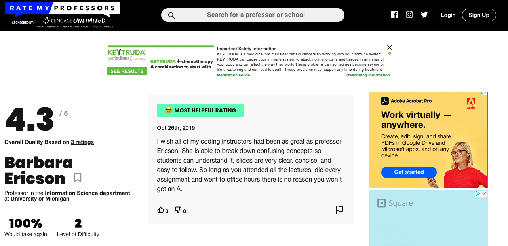

..  shortname:: Writing 2
..  description:: Writing activity 2.

Code writing activity part 3
:::::::::::::::::::::::::::::

On this page, you will complete the final activity to write code that:

**Scrapes all the comments on the Rate My Professor page for Prof. Ericson and Prof. Oney and prints them**

Here is |ericson_link|.

Here is |oney_link|.

.. |ericson_link| raw:: html

   <a href="https://www.ratemyprofessors.com/ShowRatings.jsp?tid=2454833" target="_blank">the link to Prof. Ericson's Rate My Professor page</a>

.. |oney_link| raw:: html

   <a href="https://www.ratemyprofessors.com/ShowRatings.jsp?tid=2239751" target="_blank">the link to Prof. Oney's Rate My Professor page</a>

You can see that both the pages have the same layout.

.. image:: _static/rate_my_prof_oney.png
    :scale: 50%
    :align: center
    :alt: Prof. Ericson's Rate My Professor page

The comments all have the same tag name, which is ``'div'`` tag with ``class='Comments__StyledComments-dzzyvm-0 dvnRbr'``. Here's what it looks like when you inspect Prof. Ericson's page:

.. image:: _static/rate_my_prof_tags.png
    :scale: 65%
    :align: center
    :alt: Inspecting the tags on the Rate My Professor page

.. sidebar:: Links to plans

    |plan_2|

    |plan_3|

    |plan_4|

    |plan_5|

    |plan_9|

    .. |plan_2| raw:: html

        <a href="plan2.html" target="_blank">Plan 2: Get a soup from a URL</a>

    .. |plan_3| raw:: html

        <a href="plan3.html" target="_blank">Plan 3: Get a soup from multiple URLs</a>

    .. |plan_4| raw:: html

        <a href="plan4.html" target="_blank">Plan 4: Get info from a single tag</a>

    .. |plan_5| raw:: html

        <a href="plan5.html" target="_blank">Plan 5: Get info from all tags of a certain type</a>

    .. |plan_9| raw:: html

        <a href="plan9.html" target="_blank">Plan 9: Print info</a>

Here is the code that you assembled from the plans.
Now that you've assembled the correct plans, fill in the blanks to complete the code.

.. activecode:: write_code_fill_in
        :language: python3
        :nocodelens:

        #Get the webpage
        # Load libraries for web scraping
        from bs4 import BeautifulSoup
        import requests
        # Get a soup from multiple URLs
        base_url = '___URL_goes_here___'
        endings = ['_endings_', '_go_', '_here_']
        for ending in endings:
            url = base_url + ending
            r = requests.get(url)
            soup = BeautifulSoup(r.content, 'html.parser')

            # Get all tags of a certain type from the soup
            tags = soup.find_all(____tag_description_goes_here___)
            # Collect info from the tags
            collect_info = []
            for tag in tags:
                # Get info from tag
                info = tag.______
                collect_info.append(info)

            #Do something with the info
            # Print the info
            print(______)

.. reveal:: write_code_cl_reveal_3
        :showtitle: After you've done the activity, click here.
        :hidetitle: Hide question.

        .. poll:: write_code_cl_3
           :option_1: Very, very low mental effort
           :option_2: Very low mental effort
           :option_3: Low mental effort
           :option_4: Rather low mental effort
           :option_5: Neither low nor high mental effort
           :option_6: Rather high mental effort
           :option_7: High mental effort
           :option_8: Very high mental effort
           :option_9: Very, very high mental effort
           :results: instructor

           In solving the preceding problem I invested:
