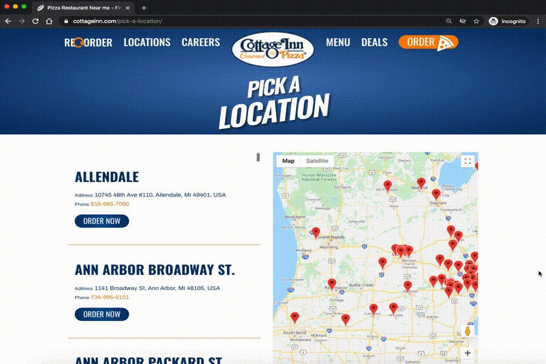

..  Copyright (C)  Brad Miller, David Ranum, Jeffrey Elkner, Peter Wentworth, Allen B. Downey, Chris
    Meyers, and Dario Mitchell.  Permission is granted to copy, distribute
    and/or modify this document under the terms of the GNU Free Documentation
    License, Version 1.3 or any later version published by the Free Software
    Foundation; with Invariant Sections being Forward, Prefaces, and
    Contributor List, no Front-Cover Texts, and no Back-Cover Texts.  A copy of
    the license is included in the section entitled "GNU Free Documentation
    License".

..  shortname:: Plan1
..  description:: Worked examples plus practice for Plan 1.

.. setup for automatic question numbering.

  
.. _plan_1:

Scrape all the Cottage Inn Pizza locations
###########################################

Let's say that you want to make a list of all the Cottage Inn Pizza locations. When you go to their website, it turns out that there are a *lot* of locations.

If only you could write a little Python to easily collect them all...

It turns out that you can! Run the code below to see what it collects.

.. activecode:: cottage_inn_example
   :language: python3
   :nocodelens:

   #Get the webpage
   # Load libraries for web scraping
   from bs4 import BeautifulSoup
   import requests
   # Get a soup from a URL
   url = 'https://web.archive.org/web/20200427175705/https://cottageinn.com/pick-a-location/'
   r = requests.get(url)
   soup = BeautifulSoup(r.content, 'html.parser')

   #Extract info from the page
   # Get all tags of a certain type from the soup
   tags = soup.find_all('h3')
   # Collect info from the tags
   collect_info = []
   for tag in tags:
       # Get info from tag
       info = tag.text
       collect_info.append(info)

   #Do something with the info
   # Print the info
   print(collect_info)

This code probably seems a bit complicated. In this ebook, we will break down web scraping into a few common "plans". This example is made up of three plans. Click on each of them to learn more.

.. raw:: html

   <pre><strong>Plan 2: Get a soup from a URL</strong>
   <a href="plan2.html"><pre style="background-color:#FCF3CF;">
   # Load libraries for web scraping
   from bs4 import BeautifulSoup
   import requests
   # Get a soup from a URL
   url = 'https://web.archive.org/web/20200427175705/https://cottageinn.com/pick-a-location/'
   r = requests.get(url)
   soup = BeautifulSoup(r.content, 'html.parser')</pre></a></pre>

   <pre><strong>Plan 5: Get info from all tags of a certain type</strong><a href="plan5.html"><pre style="background-color:#D5F5E3;">
   # Get all tags of a certain type from the soup
   tags = soup.find_all('h3')
   # Collect info from the tags
   collect_info = []
   for tag in tags:
       # Get info from tag
       info = tag.text
       collect_info.append(info)</pre></a></pre>

   <pre><strong>Plan 9: Print the info</strong><a href="plan9.html"><pre style="background-color:#D6EAF8;">
   # Print the info
   print(collect_info)</pre></a></pre>
