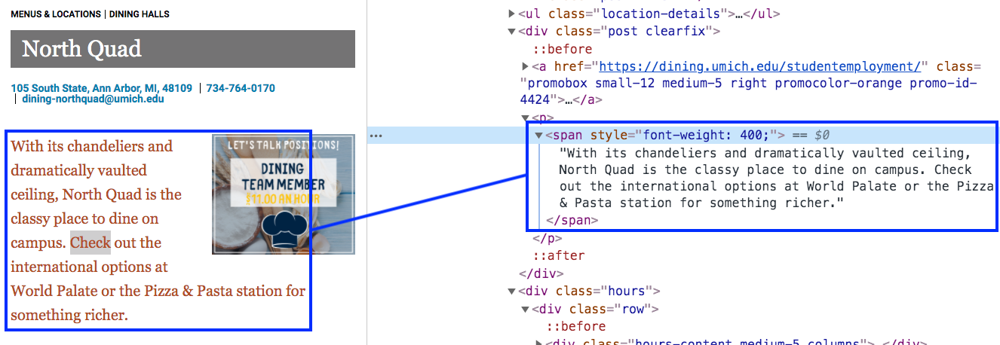

..  Copyright (C)  Brad Miller, David Ranum, Jeffrey Elkner, Peter Wentworth, Allen B. Downey, Chris
    Meyers, and Dario Mitchell.  Permission is granted to copy, distribute
    and/or modify this document under the terms of the GNU Free Documentation
    License, Version 1.3 or any later version published by the Free Software
    Foundation; with Invariant Sections being Forward, Prefaces, and
    Contributor List, no Front-Cover Texts, and no Back-Cover Texts.  A copy of
    the license is included in the section entitled "GNU Free Documentation
    License".

..  shortname:: Plan4
..  description:: Worked examples plus practice for Plan 4.

.. _plan_4:

Plan 4: Get info from a single tag
#####################################

Plan 4: Example
====================================

Maybe we want to get just one piece of information from a webpage. In this example, we want to get the first link to a news story from a professor's page.

Here's what we see when we use the "inspect" function in the browser.

.. image:: _static/ericson-more-info.png
    :scale: 70%
    :align: center
    :alt: The tag that has a link to the news article

Since that tag is the first of its type on the page, we can use the plan **Get info from a single tag**.

.. raw:: html

       <pre>Goal: Get info from a single tag
       <pre style="background-color:#A9DFBF;">
       <strong># Get first <mark>tag of a certain type</mark> from the soup</strong>
       tag = soup.find(<mark>'a', class_='item-teaser--heading-link'</mark>)
       <strong># Get <mark>info</mark> from tag</strong>
       info = tag.<mark>get('href')</mark></pre></pre>

Plan 4: When to use it
====================================

Use this when you want to get information that is in the first tag of a certain type on the page.

Plan 4: How to use it
====================================

Once you've found the tag you want to get information from, do two things:

1. Find the **tag description** and put it into the first slot.

How do you do that? Here are some examples:

==================================== === ===========================
What you see when you inspect            Tag description in the code
==================================== === ===========================
``
``                              ->  ``'p'``
``<h3>``                             ->  ``'h3'``
``
``            ->  ``'div', class_='comment'``
````            ->  ``'span', style='X5e72;'``
``<a class="css4z" href="/orders">`` ->  ``'a', class_='css4z'``
==================================== === ===========================

2. Determine if you want to get **text** from a tag, or a **link** from a tag

================= === ==========================================
The info you want     What you put in the code
================= === ==========================================
The tag's text    ->  ``text``
The tag's link    ->  ``get('href')`` or ``get('href', None)``
================= === ==========================================

One type of tag, the ``a`` tag, holds a link.

Here is the tag that creates the link to the North Quad dining hall page. It is an 'a' tag.

.. image:: _static/nq_link.png
    :scale: 80%
    :align: center
    :alt: Link to the North Quad dining hall page

If you want to get the link from a tag, use ``get('href')`` in the second slot in this plan.

Plan 4: Exercises
====================================

.. mchoice:: get_link_mc_1
    :random:

    What is the link of the tag below?

    .. image:: _static/barb_link.png
        :align: center
        :alt: Link to Barb's page

    -   https://www.si.umich.edu/people/barbara-ericson

        -   No, this is the full link, but there is a relative link in the tag.

    -   /people/barbara-ericson

        +   Correct!

    -   a

        -   No, this is the name of the tag

    -   Barbara Ericson

        -   No, this is the text of the tag

.. clickablearea:: plan4_click
    :question: If you wanted to get a link from the first 'a' tag on a webpage, which part(s) of the code below would you change? Click on those parts of the code.
    :iscode:
    :feedback: Check out the plan outline above to identify the slot.

    :click-incorrect:# Get first tag of a certain type from the soup:endclick:
    :click-incorrect:tag = soup.find(:endclick::click-correct:'div':endclick::click-correct:, class_='Comments_StyledComments-dzzyvm-0 dvnRbr':endclick:)

    :click-incorrect:# Get info from tag:endclick:
    :click-incorrect:info = tag.:endclick::click-correct:text:endclick:

Check out the image below, that inspects the description of the North Quad dining hall.

.. parsonsprob:: plan4_parsons

   Choose the subgoals that get the text from the tag that has the description of the North Quad dining hall, and put them in the right order.
   You do not need to use all the blocks.

   -----
   # Get first tag of a certain type from the soup
   tag = soup.find('span', style='font-weight: 400;')
   =====
   # Get first tag of a certain type from the soup
   tag = soup.find('span') #paired
   =====
   # Get info from tag
   info = tag.text
   =====
   # Get info from tag
   info = tag.get('href') #distractor
   =====
   # Get all tags of a certain type from the soup
   tags = soup.find_all('p')#distractor

.. fillintheblank:: get_link_fill

    What is the code to get a link from a tag?

    ``# Get first tag of a certain type from the soup``

    ``tags = soup.find('a', class_='announcement')``

    ``# Get info from tag``

    ``info = tag.`` |blank|

    -    :get\(['"]href['"](?:, None)?\): Correct.
         :get\(href\): Almost! Don't forget the quotes around 'href'.
         :href: Good start! But there is another part to it.
         :.*: Check out the highlighted parts of the example for help.

.. note::

        .. raw:: html

           <a href="example2.html" >Click here to go back to the Faculty Pages example</a>
