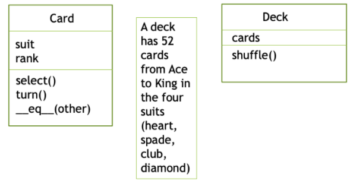

.. index:: class; multiple

Group Work with Multiple Classes
------------------------------------------------

It is best to use a POGIL approach with the following. In POGIL students work
in groups on activities and each member has an assigned role.  For more information see `https://cspogil.org/Home <https://cspogil.org/Home>`_.

.. note::

   If you work in a group, have only one member of the group fill in the answers on this page.  That person will be able to share answers with the group at the bottom of the page.

**Learning Objectives**

Students will know and be able to do the following.

*Content Objectives:*

* Explain how objects of one class can be used in another
* Identify object attributes and methods
* Identify class attributes
* Define the parts of a UML class diagram
* Explain how to use a description of a system to find classes, attributes, and methods.

*Process Objectives:*

* Modify code that involves multiple classes
* Predict output from code with multiple classes

Multiple Classes
=====================

Object-oriented programs typically have many classes.  Each class describes
the data (attributes) that objects of that class have and their behaviors (methods). One class can use objects from another class.

Let's use the Point class that we created earlier to define a Rectangle class.
A rectangle can be defined by two points if we assume that one point is the top left
and the other is the bottom right.  That means the width of a rectangle is the difference
between the x values and the height is the difference between the y values.
The area of a rectangle is the width times the height.

.. activecode:: mult_class_point_and_rectangle

   Run the code below to see what it prints.  You can also use the "Show in CodeLens" button to step through the code.
   ~~~~
   class Point:

       def __init__(self, initX, initY):
           """ Create a new point at the given coordinates. """
           self.x = initX
           self.y = initY

       def distanceFromOrigin(self):
           return ((self.x ** 2) + (self.y ** 2)) ** 0.5

       def __str__(self):
           return f"x = {self.x}, y = {self.y}"

       def halfway(self, target):
           mx = (self.x + target.x) / 2
           my = (self.y + target.y) / 2
           return Point(mx, my)

   class Rectangle:

       def __init__(self, p1, p2):
           """ Create a new rectangle with the given points """
           self.p1 = p1
           self.p2 = p2

       def area(self):
           """ Return the area of the rectangle """
           width = abs(self.p1.x - self.p2.x)
           height = abs(self.p1.y - self.p2.y)
           return width * height

   point1 = Point(0,0)
   point2 = Point(10,5)
   r1 = Rectangle(point1, point2)
   print(r1.area())
   point3 = Point(-5,-10)
   r2 = Rectangle(point2, point3)
   print(r2.area())

.. mchoice:: mult_class_rectangle_object_methods

   Look at the code above.  What are the object methods in the ``Rectangle`` class?  Pick all that apply.

   -   self.p1

       -   This is an object attribute in the Rectangle class.

   -   self.__init__

       +   This is an object method in the Rectangle class.

   -   self.p2

       -   This is an object attribute in the Rectangle class.

   -   self.area

       +   This is an object method in the Rectangle class.

.. mchoice:: mult_class_point_rect_mcq2

   Look at the code above.  What type of thing (class) is ``p1`` in the ``__init__`` method in the ``Rectangle`` class?

   -   Point

       +   It was created by the Point class and passed to the __init__ method in the Rectangle class

   -   Rectangle

       -   It is set in the __init__ method in the Rectangle class, but it is not a rectangle

   -   Tuple

       -   It is not a tuple.  Point(0,0) creates an object of the Point class and calls the __init__ method in that class.

.. mchoice:: mult_class_point_attributes

   Look at the code above.  What are the object attributes in the ``Point`` class?  Pick all that apply.

   -   self.x

       +   This stores the x position for the point. It is an object attribute.

   -   self.distanceFromOrigin

       -   This is an object method in the Point class.

   -   self.y

       +   This stores the y position for the point. It is an object attribute.

   -   self.halfway

       -   This is an object method in the Point class.

Object-Oriented Analysis and Design
=====================================

How do you determine the classes that you need and the attributes and methods that objects of the class should have?
In object-oriented analysis and design you often walk through a scenario of how the system will work.  Write down all the nouns and verbs that are mentioned.  Nouns are potential classes or attributes.  Verbs are potential methods. If a noun represents simple data like a number or string it is usually just an attribute of a class. If a noun has data associated with it or behavior then it is likely a class.

.. note ::

   One approach to object-oriented analysis and design is to use index cards to represent classes.  Write the class name at the top of the card. Put the data or attributes that each object needs to keep track of below that and the methods or behaviors that objects need to be able to do below that.

How would you create software for a simple card game?  Play the Aces and Twos card game at https://www.mathsisfun.com/games/card-match-game.html

When the game starts all of the cards are all face down in rows and columns.  You click on a card to select it and it turns over to show the suit and rank (value).  Then you click another card to select it and it also turns face up.  If the two cards match (have the same rank and value) then the cards stay facing up.  Otherwise they both turn down and you take another turn.  You win when you have found all of the matches.  The game keeps track of the total time it took you to find all of the matches.

.. mchoice:: mult_class_card_game_classes

   Look at explanation of the game above.  Which of the following nouns could be classes?

   -   Game

       +   Game is a noun and you can play a game so it has behavior so it is a good candidate class.

   -   Card

       +   Card is a noun and you can turn a card so it has behavior.  A card has a suit and rank so it has attributes.

   -   Row

       -   Row is a noun, but here it just describes how to layout the cards when you start the game. It doesn't need to be a class.

   -   Suit

       -   Suit is a noun, but it can be an integer representing one of the four suits.  It will be an attribute of a Card object.

.. mchoice:: mult_class_card_game_bevaiors

   Look at explanation of the game above.  Which of the following verbs could be methods (behaviors)?

   -   select

       +   You select a card so it could be a method on the Card class.

   -   turn

       +   You turn a card over so it could be a method on the Card class.

   -   show

       -   While this is a verb, it happens when you turn over a card. It probably doesn't need to be another method.

   -   match

       +   In the game you need to determine if two cards match, so you do need a method to support this.

UML Diagrams
=====================================

UML means Unified Modeling Language.  It is a standard way to visualize the design of an object-oriented program.  See https://en.wikipedia.org/wiki/Unified_Modeling_Language for more information.

The figure below shows a possible class diagram for a Card class.

.. figure:: ../images/card.png
    :alt: Class diagram for a Card class

In UML each class is shown in a box with the class name on top optionally followed by a line then the attributes and then optionally followed by a line and then the behaviors (methods).

To play the card game you need two of each type of card.  So you will need to two decks.  A deck has 52 cards in the four suits from Ace to King.

.. activecode:: mult_classes_card_and_deck

   Run the code below to see what it prints.  You can also use the "Show in CodeLens" button to step through the code.
   ~~~~
   class Card:

       suit_names = ["Clubs", "Diamonds", "Hearts", "Spades"]
       rank_names = ["Ace", "2", "3", "4", "5", "6", "7", "8", "9",  "10", "Jack", "Queen", "King"]

       def __init__(self, suit=0, rank = 0):
           self.suit = suit
           self.rank = rank

       def __str__(self):
           return Card.rank_names[self.rank] + " of " + Card.suit_names[self.suit]

   class Deck:

       def __init__(self):
           self.card_list = []
           for i in range(len(Card.suit_names)):
               for j in range(len(Card.rank_names)):
                   self.card_list.append(Card(i, j))

       def __str__(self):
           output = ""
           for card in self.card_list:
               output += card.__str__() + ", "
           return output

   def main():
       my_deck = Deck()
       print(my_deck)

   if __name__ == "__main__":
       main()

Notice that we have defined a list of ``suit_names`` and ``rank_names`` in the ``Card`` class.  These will be created in the class ``Card`` and not in each object of the class ``Card``.  They are called ``class attributes``.
Each object of the ``Card`` class doesn't need to have its own copy of these lists.  That would be a waste of space. Instead they are created in the class and all objects of the class have access to it.

.. fillintheblank:: mult_class_attribute_access_fitb
    :practice: T

    Use |blank|.rank_names to access the class attribute ``rank_names`` in the ``Card`` class.

    - :Card: Use the name of the class to access a class attribute
      :.*: Look at the __init__ method in the Deck class

.. mchoice:: mult-classes-card-attributes-vs-class

   Look at class ``Card`` above.  Which of the following are object attributes?  Select all that apply.

   -   suit_names

       -   This is defined in the class not on an object.  It is a class attribute.

   -   rank_names

       -   This is defined in the class not on an object.  It is a class attribute.

   -   self.suit

       +   This is an object attribute.  It is set in every card object.

   -   self.rank

       +   This is an object attribute.  It is set in every card object.

.. shortanswer:: mult_class_diff_class_and_object_attribute

   How can you tell if an attribute is a class or object attribute?

.. fillintheblank:: mult_class_deck_who_creates_cards_fitb
    :practice: T

    The |blank| function in class |blank| creates all of the card objects in the deck object.

    - :__init__: The __init__ function creates all 52 cards
      :.*: An object of a class is created with Class()
    - :Deck: The Deck class creates the 52 cards when you create a new deck
      :.*: Which class creates multiple cards?

Use the following UML class diagram to answer the next few questions.

.. figure:: ../images/flightAndAirport.png
    :alt: class diagram of a Flight and Airport class

.. mchoice:: mult-classes-flight-airport-mcq1

   Look at class diagram for ``Flight`` and ``Airport`` above.  How many object attributes does a ``Flight`` object have?

   -   3

       -   How many items are listed after the first line in the class diagram for Flight?

   -   5

       +   A Flight object has 5 object attributes: (number, departure_date, departure_time, departure_airport, and arrival_airport)

   -   7

       -   This would be true if Flight inherited from Airport, but it does not.

.. activecode:: classes_flight_and_airport

   Given the ``Airport`` class shown below and the class diagram shown above, write the ``Flight`` class with an ``__init__`` method that takes the object attributes in order from top to bottom in the class diagram (number, departure_date, departure_time, departure_airport, and arrival_airport).
   ~~~~
   class Airport:

       def __init__(self, name, code):
           self.name = name
           self.code = code

       def __str__(self):
           return f"{self.name}: {self.code}"

   ====
   from unittest.gui import TestCaseGui
   class myTests(TestCaseGui):

       def testOne(self):
           a1 = Airport("Atlanta", "ATL")
           a2 = Airport("Detroit", "DTW")
           f1 = Flight(190, "10/3/2021", "16:00", a1, a2)
           self.assertEqual(f1.number, 190, "test of f1.number")
           self.assertEqual(f1.departure_date, "10/3/2021", "test of f1.departure_date")
           self.assertEqual(f1.departure_time, "16:00", "test of f1.departure_time")
           self.assertEqual(f1.departure_airport, a1, "test of f1.departure_airport")
           self.assertEqual(f1.arrival_airport, a2, "test of f1.arrival_airport")

   myTests().main()

.. activecode:: classes_order_and_item

   Given the ``Item``  and ``Order`` classes shown below, write the ``get_total`` method in the ``Order`` class that returns a total of all of the prices of the items in the order.
   ~~~~
   class Item:

       def __init__(self, name, price):
           self.name = name
           self.price = price

       def __str__(self):
           return f"{self.name}: {self.price}"

   class Order:

       def __init__(self, items):
           self.items = items

   ====
   from unittest.gui import TestCaseGui
   class myTests(TestCaseGui):

       def testOne(self):
           i1 = Item("Burger", 6.99)
           i2 = Item("Fries", 2.99)
           i3 = Item("Coke", 1.99)
           o1 = Order([i1, i2])
           o2 = Order([i1, i3])
           o3 = Order([i2, i3])
           self.assertAlmostEqual(o1.get_total(), 9.98, 2, "test of order 1 total")
           self.assertAlmostEqual(o2.get_total(), 8.98, 2, "test of order 2 total")
           self.assertAlmostEqual(o3.get_total(), 4.98, 2, "test of order 3 total")

   myTests().main()

.. shortanswer:: mult_class_relationship_between_classes_sa

   What is the relationship between the example classes on this page, such as ``Point`` and ``Rectangle`` or ``Item`` and ``Order``?  How do they relate to each other?

If you worked in a group, you can copy the answers from this page to the other group members.  Select the group members below and click the button to share the answers.

.. groupsub:: mult_classes_groupsub
   :limit: 4
