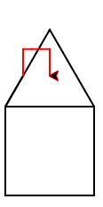

..  Copyright (C)  Mark Guzdial, Barbara Ericson, Briana Morrison
    Permission is granted to copy, distribute and/or modify this document
    under the terms of the GNU Free Documentation License, Version 1.3 or
    any later version published by the Free Software Foundation; with
    Invariant Sections being Forward, Prefaces, and Contributor List,
    no Front-Cover Texts, and no Back-Cover Texts.  A copy of the license
    is included in the section entitled "GNU Free Documentation License".

.. |bigteachernote| image:: Figures/apple.jpg
    :width: 50px
    :align: top
    :alt: teacher note

.. 	qnum::
	:start: 1
	:prefix: csp-5-5-
	
.. highlight:: java
   :linenothreshold: 4

Bob Builds a House
==============================

Let's combine the square and triangle code to create a drawing of a simple house.

.. Note::
   The program below has blank lines between the lines of code.  The computer ignores the blank lines.  We add blank lines to programs to group lines that are working together such as the lines below that draw a square.  Often a comment (starts with a ``#``) is used before a several lines of code to explain the purpose of the code. 

.. activecode:: Turtle_House
  :tour_1: "Section Tour"; 1-3: house-line1-3; 6-12: house-line5-11; 15: house-line13; 18-23: house-line18-23;
  :nocodelens:
  
  from turtle import *      # use the turtle library
  space = Screen()          # create a turtle screen (space)
  bob = Turtle()            # create a turtle named bob
  
  # Make a square
  bob.forward(100)          # tell bob to move forward by 100 units
  bob.right(90)             # turn right by 90 degrees
  bob.forward(100)          # tell bob to move forward by 100 units
  bob.right(90)             # turn right by 90 degrees
  bob.forward(100)          # tell bob to move forward by 100 units
  bob.right(90)             # turn right by 90 degrees
  bob.forward(100)          # tell bob to move forward by 100 units
  
  # Position for roof
  bob.right(90)
  
  # Make a roof
  bob.forward(100)          # tell bob to move forward by 100 units
  bob.right(-120)           # turn LEFT by 120 degrees
  bob.forward(100)          # tell bob to move forward by 100 units
  bob.right(-120)           # turn LEFT by 120 degrees
  bob.forward(100)          # tell bob to move forward by 100 units
  bob.right(-120)           # turn LEFT by 120 degrees

Let's imagine going on to make another partial square along the slope, to create a "chimney."

.. parsonsprob:: 5_5_1_Turtle_House
   :numbered: left
   :adaptive:

   Align the program pieces below to make the house and chimney figure above.  Draw the square first for the main part of the house, next draw the roof, and finally draw the chimney.
   -----
   from turtle import * 
   space = Screen()
   bob = Turtle() 
   =====
   from turtle import * 
   space = screen()
   bob = turtle() #paired
   =====
   # Make a square
   bob.forward(100) 
   bob.right(90) 
   bob.forward(100) 
   bob.right(90) 
   bob.forward(100) 
   bob.right(90) 
   bob.forward(100) 
   =====
   # Position for roof
   bob.right(90)
   =====
   # Position for roof
   bob.left(90) #paired
   =====
   # Make a roof
   bob.forward(100)   
   bob.right(-120)   
   bob.forward(100)   
   bob.right(-120)   
   bob.forward(100) 
   bob.right(-120)  
   =====
   # Position for chimney
   bob.right(-60)
   bob.forward(40)
   bob.setheading(90) 
   =====
   # Draw chimney
   bob.color("red")
   bob.forward(30)
   bob.right(90)
   bob.forward(30)
   bob.right(90)
   bob.forward(30)
   bob.right(90)
   
Let's make another square inside the house, to create a "window."

.. image:: Figures/turtle-house2.png
   :width: 120 px
   :align: center
   
.. parsonsprob:: 5_5_2_Turtle_House2
   :numbered: left
   :adaptive:

   Align the program pieces below to make the house and window figure above.  Draw the square first for the main part of the house, next draw the roof, and finally draw the window.
   -----
   from turtle import * 
   space = Screen()
   bob = Turtle() 
   =====
   from turtle import * 
   space = screen()
   bob = turtle() #paired
   =====
   # Make a square
   bob.forward(100) 
   bob.right(90) 
   bob.forward(100) 
   bob.right(90) 
   bob.forward(100) 
   bob.right(90) 
   bob.forward(100) 
   =====
   # Position for roof
   bob.right(90)
   =====
   # Position for roof
   bob.left(90) #paired
   =====
   # Make a roof
   bob.forward(100)   
   bob.right(-120)   
   bob.forward(100)   
   bob.right(-120)   
   bob.forward(100) 
   bob.right(-120)  
   =====
   # Position for window
   bob.penup()
   bob.goto(50,-30)
   bob.pendown()
   bob.setheading(0) 
   =====
   # Draw window
   bob.color("red")
   bob.forward(30)
   bob.right(90)
   bob.forward(30)
   bob.right(90)
   bob.forward(30)
   bob.right(90)
   bob.forward(30)
   
.. note::

    Discuss topics in this section with classmates. 

      .. disqus::
          :shortname: cslearn4u
          :identifier: studentcsp_5_5

